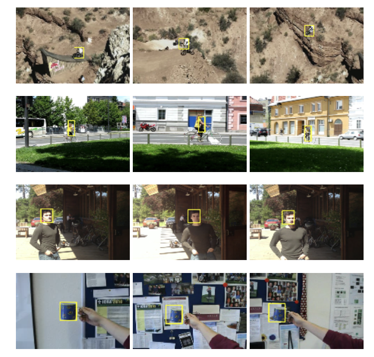

# KCF

## Dependcies
- opencv
- numpy 
- matplotlib

## Example
- 运行指令为`python run.py dataset_dir save_dir`，dataset_dir为图像序列所在目录，groundtruth文件也在该目录下，并命名为`groundtruth.txt`其bounding box的格式为左上角坐标及矩形框宽与高（x,y,w,h）,save_dir 为保存结果的目录。
- `run_tracker.py`中通过包装好的kcftracker类实现追踪，输出输入bbox格式默认为（x1,y1,x2,y2)
- 其余程序参数可通过-h指令查看，目前scale功能实现
- 例子：如当前目录下有文件夹为face的视频（文件夹内有图片序列及groundtruth.txt的文件），将结果保存于当前路径，其运行实例为： `python run.py face . `

